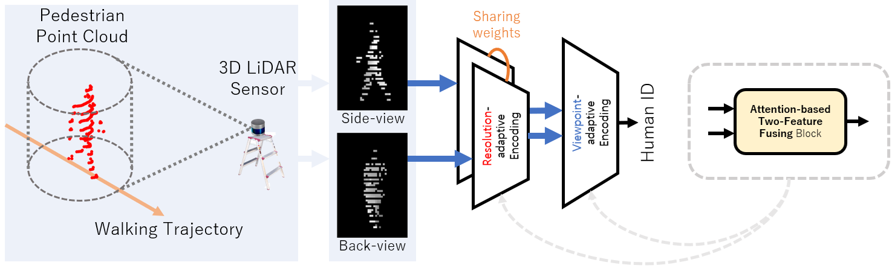
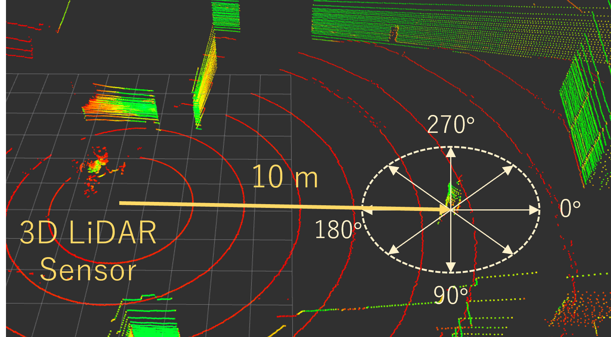
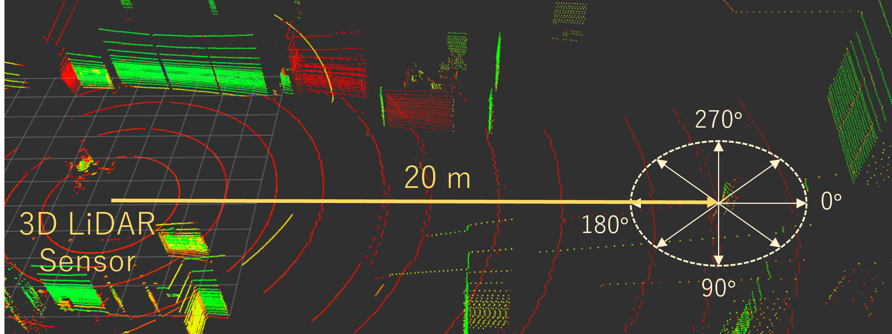
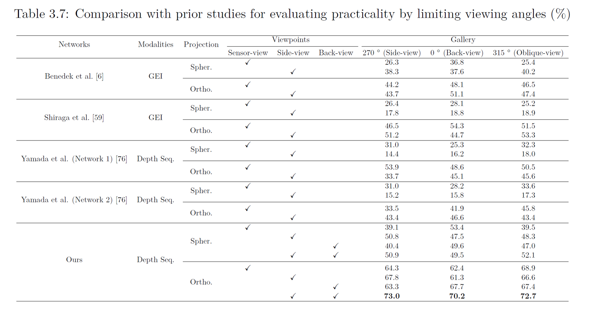

# 2VGait

* This is the official implementation of our paper, [**Learning Viewpoint-Invariant Features for LiDAR-Based Gait Recognition**](https://ieeexplore.ieee.org/document/10318107).
* 2VGait is an end-to-end framework for gait recognition using 3D LiDAR, robust to variations in viewing angles and measurement distances.
* You can also implemenet the previous version, [**2V-Gait: Gait Recognition using 3D LiDAR Robust to Changes in Walking Direction and Measurement Distance**](https://ieeexplore.ieee.org/document/9708899).


## Overview

<p align="center">
  </br>
  <span align="center">Overview of the 2VGait, which learns two viewpoint-invariant gait shapes in varying point cloud densities using an attention-based approach.</span> 
</p>


## Data collection

<p align="center">
  <br>
  <br>
  <span align="center">Data acquisition environment with two distances measured from a VLP-32C, which is visualized in a 3D point cloud format.</span> 
</p>


## Experimental result

<p align="center">
  </br>
  <span align="center">Comparison with prior studies for evaluating by limiting viewing angles (%).</span> 
</p>


## Usage

### Prepare the dataset

Our dataset, **KUGait30** is not publicly available at the moment.
However, you can refer to our implementation and adapt the dataset generation process for your own data using this codebase.


### Training
Convert the 3D pedestrian point clouds into depth-based representation and build the training sets:

````bash
python build_dataset_for_training.py \
  --dataset_path ./datasets/KUGait_VLP32C_2022-Spring-C/ \
  --yml_path ./configs/KUGait_VLP32C_2022-Spring-C/build_datasets_1020m.yml
````

Train a model:

````bash
python train.py \
  --dataset_path ./datasets/KUGait_VLP32C_2022-Spring-C/train \
  --model_path ./pretrained_20221201 \
  --batchsize 42 \
  --nepoch 50
````

### Evaluation
Build the test sets:

````bash
python build_dataset_for_test.py \
  --dataset_path ./datasets/KUGait_VLP32C_2022-Spring-C/ \
  --yml_path ./configs/KUGait_VLP32C_2022-Spring-C/build_datasets_1020m.yml

````

Evaluate the trained model:

````bash
python test.py \
  --model_path ./pretrained_20221201/model_state_dict.pth \
  --test_path ./datasets/KUGait_VLP32C_2022-Spring-C/test

````


## Citation

If you find this repository useful for your work, please cite our paper:

```bibtex
@article{access2023_ahn,
  title   = {Learning Viewpoint-Invariant Features for LiDAR-Based Gait Recognition},
  author  = {Ahn, Jeongho and Nakashima, Kazuto and Yoshino, Koki and Iwashita, Yumi and Kurazume, Ryo},
  journal = {IEEE Access},
  volume  = {11},
  number  = {},
  pages   = {129749-129762},
  year    = {2023},
  paper   = {https://doi.org/10.1109/ACCESS.2023.3333037}
}

@inproceedings{sii2022_ahn,
  title     = {2V-Gait: Gait Recognition using 3D LiDAR Robust to Changes in Walking Direction and Measurement Distance},
  author    = {Ahn, Jeongho and Nakashima, Kazuto and Yoshino, Koki and Iwashita, Yumi and Kurazume, Ryo},
  booktitle = {Proceedings of the IEEE/SICE International Symposium on System Integration (SII)},
  year      = {2022},
  pages     = {602--607},
  paper     = {https://doi.org/10.1109/SII52469.2022.9708899}
}
```
